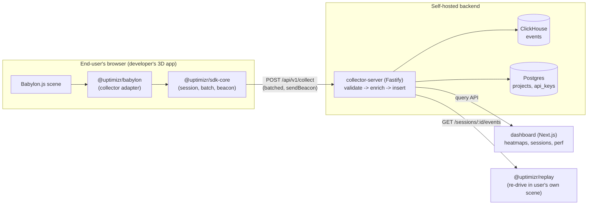

# Architecture Overview

Uptimizr is a 3D-scene analytics platform. This document describes the Phase 1 (OSS)
architecture and how the pieces connect. For the rationale behind individual decisions, see
the [Architecture Decision Records](../adr).

## High-level flow

## Components

### Capture (client-side, in the developer's app)

- **`@uptimizr/schema`** — the single source of truth for event shapes. Zod schemas + TS
  types shared by client, server, and replay. Every event must be **replay-complete**:
  ordered, timestamped, and keyed by `sessionId` with enough fidelity to reconstruct a session.
- **`@uptimizr/sdk-core`** — framework-agnostic runtime: session lifecycle, an in-memory
  batching queue, `navigator.sendBeacon` transport with retry, and cookieless config. Holds
  **no** persistent identifier on the client.
- **`@uptimizr/babylon`** — Babylon.js adapter that observes a `Scene`/`Engine` and emits
  schema events: camera sampling, pointer move/click (screen + 3D raycast hit + mesh),
  mesh interaction (hover/pick/click on named meshes), FPS/frame perf, asset-load timing,
  device/GPU caps (WebGL2 **and** WebGPU via `engine.getCaps()`), plus a `track()` passthrough
  for custom events.
- **`@uptimizr/three`** — three.js adapter emitting the identical schema events from a
  three.js `Scene` + `Camera` + `WebGLRenderer`. World-space data is normalized from three's
  right-handed frame to the canonical wire frame at the emission boundary (ADR 0018); it is a
  drop-in alternative to the Babylon connector for three.js apps.

### Ingest + store (server-side)

- **`collector-server` (Fastify)** — public `POST /api/v1/collect` endpoint that validates
  batches against `@uptimizr/schema`, enriches them (daily-rotating cookieless visitor hash,
  optional geo), and performs batched async inserts into ClickHouse. Also serves the query and
  session-timeline APIs. Protected by CORS, rate-limiting, and security headers.
- **`@uptimizr/db`** — typed ClickHouse and Postgres clients plus migrations. ClickHouse holds
  the event stream (partitioned by date, ordered by `(project_id, event_type, ts)`); Postgres
  holds project metadata and API keys.

### Consume

- **`dashboard` (Next.js + Tailwind)** — project list, live event feed, **abstract** v1
  heatmaps (2D pointer canvas + camera-direction sphere), and session/perf summaries. Full
  scene-`.glb` overlay is deferred.
- **`@uptimizr/replay`** — fetches a session's ordered event stream and re-drives
  camera/pointer/picks. The framework user runs this **in their own scene on their own infra**.

## Event model (v1)

Envelope fields: `projectId`, `visitorId` (server-set), `sessionId`, `ts`, `sdkVersion`,
`url`, `pageMeta`.

| Event                           | Purpose                                                                 |
| ------------------------------- | ----------------------------------------------------------------------- |
| `session_start` / `session_end` | Session boundaries; `session_start` carries device/GPU block.           |
| `frame_perf`                    | Sampled FPS / frame time.                                               |
| `camera_sample`                 | Camera position, direction/target, FOV — drives view-direction heatmap. |
| `pointer_move`                  | Screen-normalized position + optional 3D hit point and mesh.            |
| `pointer_click`                 | As above plus button — drives click heatmap.                            |
| `mesh_interaction`              | Hover / pick / click on a named mesh.                                   |
| `asset_load`                    | Asset name, bytes, load ms, time-to-first-frame.                        |
| `custom`                        | Developer-defined `name` + `props`.                                     |

## Privacy posture

Cookieless and GDPR-first by default. The client never generates a persistent ID; the server
derives a visitor hash from `hash(ip + ua + dailySalt)` that rotates daily. Raw per-session
retention (required for replay) is **opt-in** per deployment. See
[ADR 0003](../adr/0003-privacy-model.md).

## Phase boundaries

Phase 1 delivers everything above as the OSS product. An optional ClickHouse + Postgres scale
tier adds horizontal scale on top, reusing the same schema and storage contracts. See
[the phase plans](../phases).
