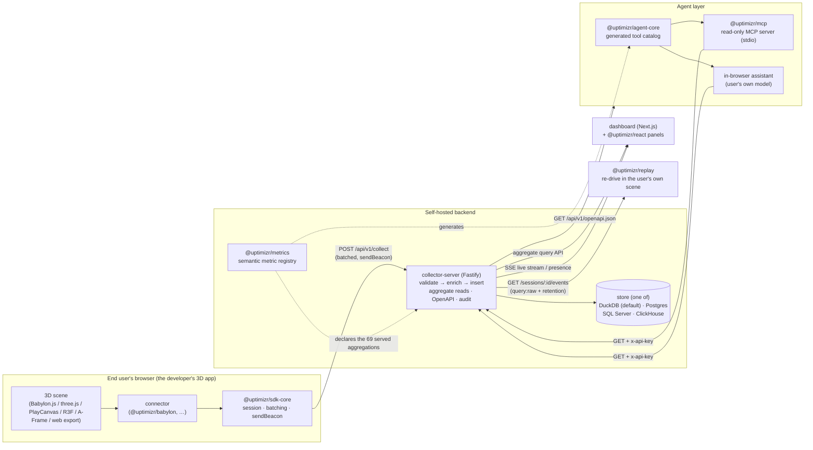
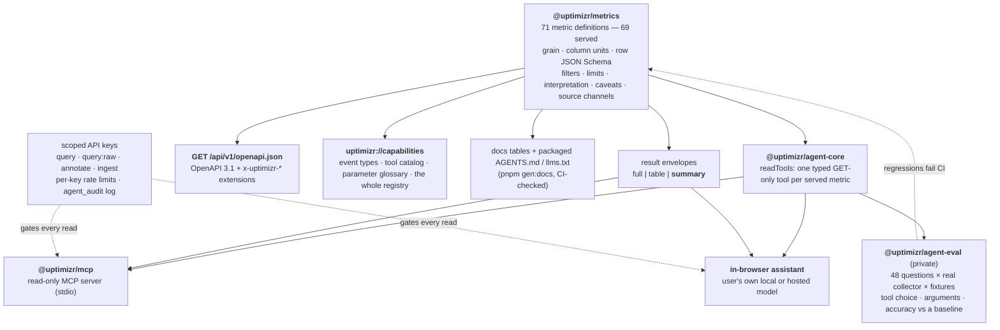

# Architecture Overview

Uptimizr is an open-source, self-hosted analytics platform for 3D scenes. This document describes
how the shipped pieces connect today. For the rationale behind individual decisions, see the
[Architecture Decision Records](../adr); for the API and SDK surface, see
[`docs/integration.md`](../integration.md).

Three properties shape everything below:

1. **One collector is the only gateway to the data.** Dashboards, replay, the in-browser assistant
   and AI agents all read the same HTTP API with the same auth and scoping. Nothing opens the store
   directly ([ADR 0005](../adr/0005-backend-framework.md)).
2. **Events are defined once**, in `@uptimizr/schema`, and validated at every boundary.
3. **Zero infrastructure to start.** The default store is an embedded DuckDB file — no external
   database service ([ADR 0020](../adr/0020-open-core-storage-boundary.md)).

## High-level flow

```mermaid
flowchart LR
  subgraph Browser["End user's browser (the developer's 3D app)"]
    Scene["3D scene<br/>(Babylon.js / three.js / PlayCanvas / R3F / A-Frame / web export)"]
    Conn["connector<br/>(@uptimizr/babylon, …)"]
    Core["@uptimizr/sdk-core<br/>session · batching · sendBeacon"]
    Scene --> Conn --> Core
  end

  Core -- "POST /api/v1/collect<br/>(batched, sendBeacon)" --> Collector

  subgraph Server["Self-hosted backend"]
    Collector["collector-server (Fastify)<br/>validate → enrich → insert<br/>aggregate reads · OpenAPI · audit"]
    Store[("store (one of)<br/>DuckDB (default) · Postgres<br/>SQL Server · ClickHouse")]
    Reg["@uptimizr/metrics<br/>semantic metric registry"]
    Collector --> Store
    Reg -. "declares the 69 served aggregations" .-> Collector
  end

  Collector -- "aggregate query API" --> Dashboard["dashboard (Next.js)<br/>+ @uptimizr/react panels"]
  Collector -- "SSE live stream / presence" --> Dashboard
  Collector -- "GET /sessions/:id/events<br/>(query:raw + retention)" --> Replay["@uptimizr/replay<br/>re-drive in the user's own scene"]

  subgraph Agents["Agent layer"]
    AgentCore["@uptimizr/agent-core<br/>generated tool catalog"]
    Mcp["@uptimizr/mcp<br/>read-only MCP server (stdio)"]
    Assistant["in-browser assistant<br/>(user's own model)"]
    AgentCore --> Mcp
    AgentCore --> Assistant
  end

  Reg -. generates .-> AgentCore
  Collector -- "GET /api/v1/openapi.json" --> Agents
  Mcp -- "GET + x-api-key" --> Collector
  Assistant -- "GET + x-api-key" --> Collector
```

## Components

### Capture (client-side, in the developer's app)

- **`@uptimizr/schema`** — the single source of truth for event shapes: Zod schemas plus TypeScript
  types shared by client, server, replay and the metric registry. Every event is
  **replay-complete**: ordered, timestamped, keyed by `sessionId`, and detailed enough to
  reconstruct the session.
- **`@uptimizr/sdk-core`** — framework-agnostic runtime: session lifecycle, an in-memory batching
  queue, a `navigator.sendBeacon` transport with retry, cookieless configuration, capture-fidelity
  dials ([ADR 0012](../adr/0012-sampling-and-fidelity.md)), the scene registry
  ([ADR 0014](../adr/0014-scene-registry.md)) and scene-region registration. Holds **no** persistent
  identifier on the client.
- **Connectors** — one adapter per engine, all emitting the identical schema events, with
  world-space data normalised to the canonical wire coordinate frame at the emission boundary
  ([ADR 0018](../adr/0018-coordinate-frame-and-connector-provenance.md)):
  `@uptimizr/babylon`, `@uptimizr/babylon-lite`, `@uptimizr/three`, `@uptimizr/r3f`,
  `@uptimizr/playcanvas`, `@uptimizr/aframe`, plus the web-export tier
  (`@uptimizr/web-export` and the `@uptimizr/unity` / `@uptimizr/godot` / `@uptimizr/unreal`
  bridges, [ADR 0045](../adr/0045-web-export-engine-connectors.md)).

### Ingest + store (server-side)

- **`collector-server` (Fastify)** — the one gateway. A keyless `POST /api/v1/collect` validates
  batches against `@uptimizr/schema` and enriches them (daily-rotating cookieless visitor hash,
  coarse user-agent classification); the read side serves ~69 aggregate endpoints, the scene and
  region registries, the SSE live stream, the raw replay timeline, an OpenAPI document, `whoami` and
  the agent audit log. Protected by CORS, per-key and per-IP rate limiting, bounded bodies and
  security headers. It stays thin: aggregation lives in the store packages, semantics in the
  registry.
- **Storage** — the same dialect-agnostic query contracts over four engines, selected with
  `COLLECTOR_STORE` ([ADR 0002](../adr/0002-database.md),
  [ADR 0019](../adr/0019-simplified-single-store-backend.md),
  [ADR 0020](../adr/0020-open-core-storage-boundary.md)):

  | `COLLECTOR_STORE`      | Package                   | When                                                                              |
  | ---------------------- | ------------------------- | --------------------------------------------------------------------------------- |
  | `duckdb` **(default)** | `@uptimizr/db`            | A single embedded file holds events **and** metadata. No external service to run. |
  | `postgres`             | `@uptimizr/db-postgres`   | Self-hosters who already operate Postgres.                                        |
  | `mssql`                | `@uptimizr/db-mssql`      | Shops standardised on SQL Server / Azure SQL.                                     |
  | `clickhouse`           | `@uptimizr/db-clickhouse` | High-volume ingestion; the scale tier.                                            |

  `@uptimizr/db` also owns the migrations, the aggregation builders, and the result-envelope shaping
  (`tableResult` / `summarizeRows`). A parity suite proves every optional store returns the same rows
  as DuckDB for the same fixtures.

### Consume — humans

- **`dashboard` (Next.js + Tailwind)** — projects, live event feed and presence, 2D/3D heatmaps,
  mesh and navigation panels, performance and XR views, session replay and the in-browser assistant.
- **`@uptimizr/react`** — the embeddable panel catalog and `CollectorApi` client
  ([ADR 0047](../adr/0047-react-owns-oss-panel-catalog.md)), so the same panels drop into a
  host app; `@uptimizr/heatmap` renders in-scene overlays.
- **`@uptimizr/replay`** — fetches a session's ordered event stream and re-drives camera, pointer,
  picks and named scene actors **in the user's own scene, on their own infrastructure**
  ([ADR 0006](../adr/0006-session-replay.md), [ADR 0049](../adr/0049-session-replay-live-presence-portable-panels.md)).

### Consume — agents

See [Agent layer](#agent-layer) below.

## Event catalogue

Envelope fields: `projectId`, `visitorId` (server-set), `sessionId`, `ts`, `sdkVersion`, `url`,
`sceneId`, `pageMeta`. The canonical list is `EVENT_TYPES` in `@uptimizr/schema` — **29** types:

| Event                               | Purpose                                                                                                                                                |
| ----------------------------------- | ------------------------------------------------------------------------------------------------------------------------------------------------------ |
| `session_start` / `session_end`     | Session boundaries. `session_start` carries the device, graphics-backend and scene context blocks.                                                     |
| `frame_perf`                        | Sampled FPS, frame time, p95/p99 and long-frame counts, plus `dpr` / `renderScale` so an FPS claim stays honest.                                       |
| `camera_sample`                     | Sampled camera pose — position, direction, optional target and FOV. Backbone of the view-direction heatmap.                                            |
| `node_transform`                    | Sampled world transform of a developer-named scene actor, so replay can reproduce objects that move on their own.                                      |
| `pointer_move`                      | Screen-normalised position plus optional 3D hit point and mesh.                                                                                        |
| `pointer_click`                     | As above plus button — drives the click heatmap and click rays.                                                                                        |
| `pointer_down` / `pointer_up`       | Raw button transitions, bracketing every press (press-and-hold, drags, abandoned clicks).                                                              |
| `camera_gesture`                    | A discrete, user-initiated viewpoint change (orbit, pan, dolly, …) — navigation _intent_, not ambient pose.                                            |
| `mesh_interaction`                  | Hover / pick / click / XR select, squeeze, grab, release, teleport on a named mesh.                                                                    |
| `mesh_visibility`                   | Per-object attention: bucketed visible and on-screen time per window.                                                                                  |
| `hover_dwell`                       | The pointer lingered over an object **without** acting on it — the "users don't realise this is interactive" signal.                                   |
| `compile_stall`                     | A main-thread stall while a shader, pipeline or material compiled.                                                                                     |
| `resource_sample`                   | Sampled GPU / memory footprint.                                                                                                                        |
| `capability_change`                 | A runtime capability or fidelity transition (backend downgrade, quality tier, device recovery).                                                        |
| `asset_load`                        | Asset name, bytes, load ms and time-to-first-frame.                                                                                                    |
| `scene_change`                      | The app moved to another scene, area or level.                                                                                                         |
| `viewport_resize`                   | Canvas / window size changed.                                                                                                                          |
| `visibility_change`                 | The tab became hidden or visible.                                                                                                                      |
| `focus_change`                      | The canvas gained or lost input focus (distinct from visibility).                                                                                      |
| `context_lost` / `context_restored` | The GPU context was lost and later restored.                                                                                                           |
| `graphics_diagnostic`               | An engine diagnostic, severity-tagged (`info` → `fatal`).                                                                                              |
| `runtime_error`                     | A captured runtime error or unhandled rejection, redacted per [ADR 0013](../adr/0013-error-capture-privacy.md).                                        |
| `input_action`                      | A discrete non-pointer input: keyboard chord or gamepad button mapped to an app action ([ADR 0023](../adr/0023-input-action-and-keyboard-gamepad.md)). |
| `xr_boundary_proximity`             | The visitor approached or touched the guardian / play-area boundary.                                                                                   |
| `ar_placement`                      | An AR model placement, with a coarse surface bucket ([ADR 0048](../adr/0048-ar-vr-spatial-analytics.md)).                                              |
| `custom`                            | Developer-defined `name` + shallow `props` — the application-level extension point.                                                                    |

Adding an event means adding it in `@uptimizr/schema` first; the store, the connectors and the
registry all derive from there.

## Agent layer

Agents are treated as a primary consumer of the data, alongside the dashboard
([ADR 0051](../adr/0051-ai-first-analytics-layer.md), building on
[ADR 0017](../adr/0017-consumer-facing-agents.md) and
[ADR 0050](../adr/0050-in-browser-analytics-assistant.md)). The layer is a pipeline, and every stage
after the first is **generated**:

```mermaid
flowchart TD
  Reg["<b>@uptimizr/metrics</b><br/>71 metric definitions — 69 served<br/>grain · column units · row JSON Schema<br/>filters · limits · interpretation · caveats · source channels"]
  Tools["<b>@uptimizr/agent-core</b><br/>readTools: one typed GET-only tool per served metric"]
  OpenApi["<b>GET /api/v1/openapi.json</b><br/>OpenAPI 3.1 + x-uptimizr-* extensions"]
  Caps["<b>uptimizr://capabilities</b><br/>event types · tool catalog · parameter glossary · the whole registry"]
  Docs["docs tables + packaged AGENTS.md / llms.txt<br/>(pnpm gen:docs, CI-checked)"]
  Mcp["<b>@uptimizr/mcp</b><br/>read-only MCP server (stdio)"]
  Asst["<b>in-browser assistant</b><br/>user's own local or hosted model"]
  Fmt["result envelopes<br/>full | table | <b>summary</b>"]
  Keys["scoped API keys<br/>query · query:raw · annotate · ingest<br/>per-key rate limits · agent_audit log"]
  Eval["<b>@uptimizr/agent-eval</b> (private)<br/>48 questions × real collector × fixtures<br/>tool choice · arguments · accuracy vs a baseline"]

  Reg --> Tools
  Reg --> OpenApi
  Reg --> Caps
  Reg --> Docs
  Reg --> Fmt
  Tools --> Mcp
  Tools --> Asst
  Fmt --> Mcp
  Fmt --> Asst
  Keys -.->|gates every read| Mcp
  Keys -.->|gates every read| Asst
  Tools --> Eval
  Eval -.->|regressions fail CI| Reg
```

- **Metric registry — `@uptimizr/metrics`.** A dependency-light package (`zod` +
  `@uptimizr/schema`, deliberately **no** database driver, so `npx @uptimizr/mcp` does not drag a
  ~37 MB DuckDB binding along) holding 71 metric definitions. Each declares what one row _is_, each
  column's unit, the row's JSON Schema, accepted filters, row limits, interpretation notes, caveats
  and the capture channels that feed it. A CI test asserts every aggregation builder has a registry
  entry and that each endpoint's Zod querystring matches the declared filters, so adding an
  aggregation without a registry entry fails the build.
- **Generated tools, OpenAPI and capabilities.** `readTools` in `@uptimizr/agent-core` is rendered
  from the registry — one typed, `GET`-only tool per served metric, with the metric's caveats in its
  description and an output schema for its rows. The collector renders the same registry into an
  OpenAPI 3.1 document (`GET /api/v1/openapi.json`, no key required), and `@uptimizr/mcp` renders it
  into the `uptimizr://capabilities` resource. `pnpm gen:docs` renders it into the docs tables and
  the packaged `AGENTS.md` / `llms.txt`, and `pnpm gen:docs:check` fails when any of them drift.
- **Two clients, one catalog.** `@uptimizr/mcp` is a read-only MCP server over stdio; the dashboard's
  in-browser assistant runs the user's **own** model (WebLLM locally, or a hosted backend with their
  own key). Both consume `@uptimizr/agent-core`, so the agent surface is defined once and cannot
  drift. Neither exposes ingestion, mutation or raw per-session tools.
- **Agent-shaped results.** Every aggregate read accepts `format=full | table | summary`. `summary`
  returns a bounded digest — ranked rows, a trend, or merged spatial clusters — with shares, a
  sample size, the metric's caveats and a templated `reading` sentence, capped at the metric's
  `maxSummaryRows`. The templating is pure code, never a model, so identical rows always produce
  identical words.
- **Scoped keys and audit.** A key carries a capability set (`query`, `query:raw`, `annotate`,
  `ingest`) rather than a single role; `query` covers every aggregate read, `query:raw` additionally
  gates raw per-session streams (and is only honoured when `ENABLE_RAW_SESSION_RETENTION` is on),
  and `annotate` is the narrow metadata-write path — events stay append-only. Keys can carry their
  own rate budget, bucketed on the key id, and every authenticated non-dashboard request is written
  to the agent audit log (route pattern, redacted params, row count, duration, status — refusals
  included) readable at `GET /api/v1/audit`.
- **The catalog is measured.** `@uptimizr/agent-eval` (private to the repository — an instrument,
  not a shipped package) asks 48 real analytics questions of an agent through the _real_ collector
  over deterministic fixtures, scoring tool selection, argument correctness and answer accuracy
  against a committed baseline. That is what keeps the registry's descriptions honest: a description
  that makes a model choose badly fails CI rather than quietly producing a wrong answer.

## Privacy posture

Cookieless and GDPR-first by default ([ADR 0003](../adr/0003-privacy-model.md)). The client never
generates a persistent identifier; the server derives a visitor hash from `hash(ip + ua + dailySalt)`
that rotates daily, and raw IPs are never stored. Aggregates are the default surface — raw
per-session retention (required for replay and live-follow) is **opt-in per deployment** and, since
ADR 0051 §7, additionally gated on the `query:raw` key capability. Captured errors are redacted
([ADR 0013](../adr/0013-error-capture-privacy.md)) and AR/XR events carry only coarse buckets, never
room geometry.

## Boundaries

Everything above is the open-source product, Apache-2.0, and runs with no Uptimizr-operated service
of any kind: no telemetry to us, no hosted API, no bundled model or key. The optional Postgres,
SQL Server and ClickHouse stores are scale and fit choices, not a feature tier. See
[ADR 0004](../adr/0004-monorepo-separation.md), [ADR 0020](../adr/0020-open-core-storage-boundary.md)
and [the phase plans](../phases).
