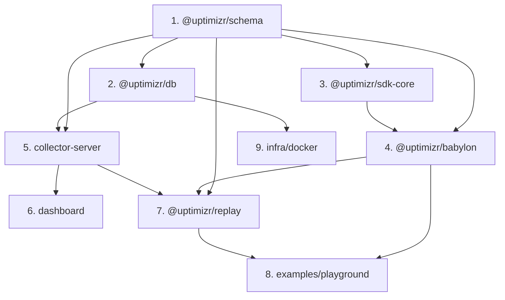

# Phase 1 — OSS MVP (data-collector + Babylon connector)

> **Goal:** a self-hostable, open-source 3D analytics product: capture events from a Babylon.js
> scene, ingest and store them, visualize them in a minimal dashboard, and replay a session in
> the user's own scene.

## Scope

In scope: SDK (core + Babylon adapter), additional engine connectors (three.js, PlayCanvas, R3F,
A-Frame), ingestion + query API, ClickHouse/Postgres storage, minimal dashboard (live feed +
abstract heatmaps + sessions/perf), session replay package, demo playground, local Docker stack.

Out of scope: multi-tenancy, billing, funnels/retention, ClickHouse
materialized views, full scene-`.glb` heatmap overlay.

## Steps & dependencies

Build order respects the dependency graph below.

1. **`@uptimizr/schema`** — Zod contracts + TS types for the envelope and all v1 event types.
   Replay-complete. _(No dependencies — build first.)_
2. **`@uptimizr/db`** — ClickHouse migrations (events table partitioned by date, ordered by
   `(project_id, event_type, ts)`) + Postgres (`projects`, `api_keys`) + typed clients.
   _(Can build in parallel with step 3.)_
3. **`@uptimizr/sdk-core`** — session manager, batching queue, `sendBeacon` transport with
   retry, cookieless config. _(Parallel with step 2.)_
4. **`@uptimizr/babylon`** — adapter: camera sampling, pointer observers, pick/raycast on named
   meshes, FPS via engine perf counters, asset-load hooks, device/GPU caps (WebGL2 + WebGPU),
   `track()` passthrough. _(Depends on 1 + 3.)_
5. **`collector-server`** (Fastify) — `POST /api/v1/collect` (validate → enrich with daily
   visitor hash → batched ClickHouse insert), query/aggregation API, and
   `GET /api/v1/sessions/:id/events` timeline. CORS, rate-limit, security headers.
   _(Depends on 1 + 2.)_
6. **`dashboard`** (Next.js + Tailwind) — projects list, live event feed, abstract
   camera-direction heatmap, 2D pointer heatmap canvas, sessions/perf summary. _(Depends on 5.)_
7. **`@uptimizr/replay`** — framework-agnostic replay core + Babylon driver; fetches a session's
   ordered event stream and re-drives it in the user's own scene. _(Depends on 1 + 4 + 5.)_
8. **`examples/playground`** — demo scene wired to `@uptimizr/babylon` and
   `@uptimizr/replay`. _(Depends on 4 + 7.)_
9. **`infra/docker`** — `docker-compose` for ClickHouse + Postgres (+ Adminer), migrate/seed
   scripts. _(Depends on 2.)_

## Metrics captured in v1

Camera/view-direction heatmap · pointer move + click heatmap (screen + 3D raycast) ·
session + FPS + device/GPU · mesh interaction (hover/pick/click on named meshes) · camera
position/path trails · custom events · asset/load performance (time-to-first-frame).

## Verification

- `pnpm -w turbo run lint typecheck build test` green across all packages.
- **Unit:** Zod schema validation; sdk-core batching/transport with a mocked `sendBeacon`.
- **Integration:** `docker-compose up` → POST a batch to `/collect` → assert rows in ClickHouse
  → query API returns correct aggregates.
- **Manual E2E:** run the playground + dashboard, interact with the scene, watch heatmaps
  populate; replay a captured session in the playground scene.
- **Privacy check:** confirm no client persistent ID and that the visitor hash rotates daily.

## Exit criteria

A developer can `docker-compose up`, point a Babylon scene at the collector via
`@uptimizr/babylon`, see live heatmaps and session/perf data in the dashboard, and replay a
session — all self-hosted, with green CI.
