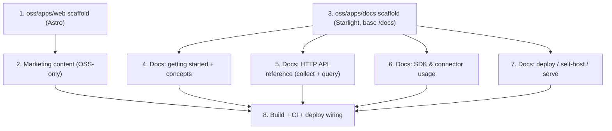

# Phase 1.5 — Public web presence (OSS)

> **Goal:** ship the public-facing web surfaces for the **open-source** project — a marketing
> site at `uptimizr.com` and developer documentation at `uptimizr.com/docs` — covering only the
> self-hostable OSS collector. **No hosting/SaaS messaging** appears anywhere.

Phase 1.5 sits just after the OSS MVP ([Phase 1](./phase-1-oss-mvp.md)). Phase 1 makes the
product _work_; Phase 1.5 makes it
_discoverable and adoptable_ by developers who will self-host it. It is intentionally small and
content-heavy rather than a new architectural surface.

## Scope

**In scope**

- **`oss/apps/web`** — Astro marketing site served at the `uptimizr.com` apex. Explains what
  Uptimizr is (Google-Analytics-for-3D), the OSS value proposition, the core capabilities
  (view-direction + pointer/click heatmaps, mesh interactions, session/perf, session replay,
  multi-engine connectors), and drives developers to GitHub and the docs. Self-host is the only
  call to action.
- **`oss/apps/docs`** — Astro **Starlight** documentation served under `uptimizr.com/docs`
  (`base: '/docs'`). Getting started, core concepts, the collector **HTTP API reference**
  (ingestion + query), SDK/connector usage per engine, and a **deploy / self-host / serve** guide.

**Out of scope**

- Any SaaS marketing: pricing, sign-up, "cloud", "managed", accounts,
  billing. The marketing site must read as an OSS project, not a product with a paid tier.
- Documentation for scale-tier-only features (tenancy, org admin, billing).

## Relationship to existing decisions (why no new ADR)

This phase introduces **no new architectural decision**, so it does not warrant an ADR:

- **The brand domain is already decided.** `uptimizr.com` is the brand domain hosting the
  **marketing + docs** website, with docs living on the apex (here: `uptimizr.com/docs`, not a
  separate subdomain). Phase 1.5 builds the OSS-only version of that website.
- **Self-host story is reused.** The deploy/serve docs build on the self-host work
  ([#55](https://github.com/RaananW/Uptimizr/issues/55)) and the distribution / self-host DX
  decision ([ADR 0029](../adr/0029-distribution-and-self-host-dx.md)); they document, not decide.
- **Content sources already exist.** [`docs/integration.md`](../integration.md),
  [`docs/architecture/overview.md`](../architecture/overview.md), the privacy model
  ([ADR 0003](../adr/0003-privacy-model.md)), and the `query-analytics` skill are the source of
  truth the docs site curates for a public audience.

Per [ADR 0016](../adr/0016-work-tracking.md), this doc is the **map**; the GitHub issues below are
the **moving pieces**. These are public OSS surfaces, so the issues live in this repo under the
**Public release** milestone.

## Steps & dependencies

1. **Scaffold `oss/apps/web`** — Astro app with its own `package.json` and `tsconfig.json`
   extending `../../tsconfig.base.json`; expose `build`, `dev`, `lint`, `typecheck`, `clean` with
   declared Turborepo outputs. Apply the brand from
   [`docs/design/brand-guidelines.md`](../design/brand-guidelines.md). `"private": true`.
2. **Marketing content** — home (what/why), capabilities, a self-host quickstart CTA, and links to
   GitHub + `/docs`. Strict copy review: **no hosting/pricing/cloud language**.
3. **Scaffold `oss/apps/docs`** — Astro **Starlight** with `base: '/docs'` so it serves at
   `uptimizr.com/docs`; same package/tsconfig/task conventions as above.
4. **Getting started + concepts** — install a connector, point it at a self-hosted collector, see
   data; concept pages for events, the envelope, heatmaps, replay, the privacy model.
5. **HTTP API reference** — the collector ingestion (`POST /api/v1/collect`) and query/aggregation
   endpoints, plus `GET /api/v1/sessions/:id/events`; curated from `docs/integration.md` and the
   `query-analytics` skill. Document auth, params, and the aggregate-response gotchas.
6. **SDK & connector usage** — `@uptimizr/sdk-core` config and a per-connector page (Babylon,
   three.js, PlayCanvas, R3F, A-Frame) with `trackScene` options and `dispose()` cleanup.
7. **Deploy / self-host / serve** — `docker-compose` / DuckDB single-store quickstart, serving the
   static dashboard, configuration/env, CORS, and the privacy/visitor-hash notes; builds on
   [#55](https://github.com/RaananW/Uptimizr/issues/55) and ADR 0029.
8. **Build + CI + deploy wiring** — add both apps to Turborepo, run their `build`/`lint`/
   `typecheck` in CI, add a link/anchor check, and define the static deploy target for the apex
   (`/` → web, `/docs` → docs). Hosting/DNS provisioning of the live domain remains an ops step.

## Deliverables

- `oss/apps/web` (Astro) — an OSS-only marketing site, brand-consistent, buildable in CI.
- `oss/apps/docs` (Astro Starlight) — getting started, concepts, HTTP API reference, SDK/connector
  usage, and a self-host/deploy guide, served under `/docs`.
- Turborepo + CI wiring for both apps, with a working static build and link check.

## Verification

- `pnpm -w turbo run lint typecheck build` is green including the two new apps.
- The marketing site contains **zero** hosting/SaaS/pricing references (grep the build output for
  `cloud|pricing|sign[ -]?up|managed|app\.uptimizr` → no marketing hits).
- The docs site builds with `base: '/docs'` and all internal links/anchors resolve.
- A new developer can follow the docs to stand up a self-hosted collector and send their first
  event without reading source.

## Exit criteria

`uptimizr.com` presents the OSS project (no hosting), `uptimizr.com/docs` documents how to use,
deploy, and serve the self-hosted collector and SDK, both apps build green in CI, and the content
is sourced from the canonical docs/ADRs — ready to point real DNS at when the project goes public.
